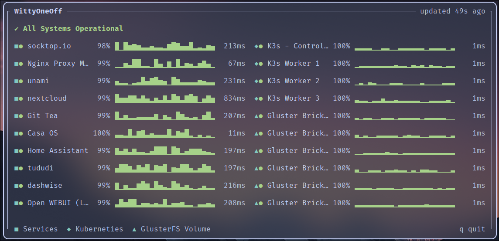

# uptime-kuma-status

[](https://crates.io/crates/uptime-kuma-status)
[](./LICENSE)

Render a public [Uptime Kuma](https://github.com/louislam/uptime-kuma) status page in your terminal.



Built to sit in a tmux pane next to [socktop](https://github.com/jasonwitty/socktop) on a wall-mounted rack display with [socktop swipe](https://gt.wittyoneoff.com/jason/socktop-swipe), but its useful just from your terminal as well. May do some stuff with waybar and quickshell in the future, stay tuned.

Generally this project is meant to support the feature implemented, I am not looking to expand this out to a complete CLI or tui for all uptime kuma features. The current web interface is already good for doing that and that would be redundant. There are also others who have started on that project. 

## Install (requires rust toolchain https://rustup.rs/)

```sh
cargo install uptime-kuma-status
```

Or from a checkout:

```sh
cargo install --path .
```

Needs Rust 1.85 or newer (edition 2024). Five dependencies, no async runtime:
`ratatui`, `crossterm`, `ureq`, `serde`, `serde_json`.

## Usage

```
uptime-kuma-status <STATUS_PAGE_URL> [OPTIONS]

ARGS:
    <STATUS_PAGE_URL>   e.g. https://status.example.com/status/myslug

OPTIONS:
    --interval <secs>   refresh period, default 60 (minimum 5)
    --max <n>           max monitors shown per screen (default: as many as fit)
    --ascii             ASCII-only glyphs for terminals with poor Unicode fonts
    -h, --help          print this help

KEYS:
    q / Esc / Ctrl-C    quit
    r                   refresh now
```

The URL is the page you would open in a browser. A trailing slash, a query
string, and a reverse-proxied sub-path all work.

## Reading the display

```
■● socktop.io            99.04% ▄▂█▃█▃▃▂▃▄▆▄▆▇▃▄▂▃▄█▄▄▃▄▆▂▂▅█▃▃██▃▇▅   250ms
▲  ▲                     ▲      ▲                                      ▲
│  │                     │      │                                      └ latest ping
│  │                     │      └ one cell per heartbeat, oldest left
│  │                     └ uptime over 24 hours
│  └ current status
└ which group it belongs to
```

## Theming

Adopts your terminal theme - the screenshots above are Catppuccin Frappe.

If your font renders the block and shape characters poorly, `--ascii` swaps
every glyph, including the window border, for plain ASCII.

## Development

```sh
cargo test                  # 52 unit tests, no network needed
cargo clippy --all-targets
```


## Contributing

Issues and pull requests are welcome. The scope is deliberately fixed:
displaying public Uptime Kuma status pages, and nothing else. Features
requiring authentication, or support for other monitoring systems, are out of
scope by design.

## License

MIT
